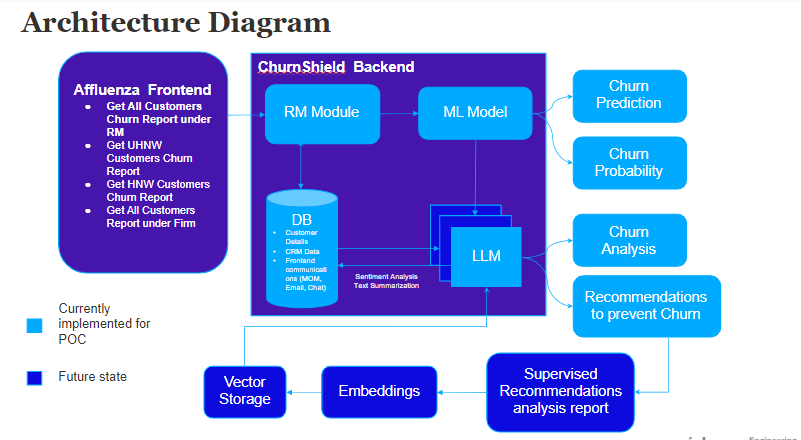

# ChurnShield - GenAI Powered Customer Churn Prediction and Prevention

## Description
This project presents a predictive model tailored for wealth management firms to forecast customer churn, along with a comprehensive analysis and actionable steps to prevent churn. The model is designed to assist Relationship Managers (RMs) in identifying at-risk customers and implementing proactive strategies to retain them.


## Key Features
**Churn Prediction & Probability:** Utilizes a machine learning (ML) model to predict customer churn and estimate the probability of churn for individual clients.

**Analysis and Preventive Steps:** Employs a Generative AI (GenAI) model to analyze customer data and recommend strategic actions to mitigate churn risk.
RM Integration: Designed for seamless integration into the workflow of Relationship Managers, providing churn reports and actionable insights for their client portfolios.

## Architecture



* As get-churn-report API call initiated, RM module will fetch the customers allocated to him/her
* For each customer, RM module will fetch customer details, CRM Data, Frontend communications(Emails, Chats, MOMs) and provide it to ML model for churn prediction
* The prediction results along with probability and customer data(details, CRM Data, Frontend communications) will be given as inputs to LLM to provide Customer Analysis and steps to recommend best actions to prevent churn
* LLM is being used to process Frontend communications, LLM model will provide sentiment analysis and text summarization for further processing
* For ML model sentiment analysis of Frontend communications will be used to predict churn
* For LLM, test summarization is used as input to provide analysis and preventive steps

## Installation
1. Clone the project into your local machine
```
git clone https://github.com/jayarajmadanu/CustomerChurnPrediction-GenAI-2.git
```
2. Create seperate conda environment(Optional)
```
conda create -p venv python=3.11.4
```
3. Install required packages from requirements.txt file
```
pip install -r requirements.txt
```
## Configuration

After successful installation, you need to setup OPENAI_API_KEY.
1. Create .env file in the root directory of this project
2. Create an api key in OpenAI
3. Add OPENAI_API_KEY in .env file
```
OPENAI_API_KEY=<the from OpenAI>
```

## Usage
ChurnShield Application provides 2 APIs 
1. To get the churn report of customers under RM(Method type: POST)
```
http://127.0.0.1:5000/get-churn-report
```
provide RM id in the body
```
{
    "rm_id":"2001"
}
```
Sample Response:
```
{"columns":["customer_id","churn","probability","analysis","preventive_steps"],"index":[0,1],"data":[[1001066,1,0.6466273069,"Based
on the provided customer details, it can be observed that the customer is a 59-year-old male with a high total amount
invested and previous AUM. However, the customer has been inactive for 3 months and has a customer rating for service of
5, which is below the acceptable range. The customer has also raised 9 complaints in the last year, which is a cause for
concern. The customer's net promoter score is also on the lower end at 6. These factors, combined with the fact that the
customer falls under the UHNW category, indicate a high risk of churn.","To prevent churn, it is important to address
the customer's concerns and improve their overall satisfaction. The first step would be to reach out to the customer and
address any issues they may have with the service. Additionally, providing personalized and proactive support, such as
regular check-ins and updates on their investments, can help improve the customer's satisfaction. It is also important
to ensure that the customer's complaints are resolved promptly and effectively. Offering incentives or rewards for their
loyalty can also help retain the customer. Finally, providing a seamless and user-friendly online platform for managing
their investments can help prevent any future issues."],[1001070,1,0.6466273069,"Based on the provided customer details,
the customer is a 61-year-old male with a high total amount invested and previous AUM. However, the customer has been
inactive for 2 months and has a customer rating for service of 10.0, indicating satisfaction with the service provided.
The customer has also expressed appreciation for the bank's service and recommended it to others. The customer has a
high total and last 1-year returns percentage, but has raised 5 complaints in the last year with no unresolved issues.
The Net Promoter Score is 6.0, which is below the average good customer rating for service of 7.0. Based on these
details, there is a potential risk of churn due to the customer's age and inactivity, as well as the high number of
complaints raised.","To prevent churn, it is important to address the customer's inactivity and ensure that they are
satisfied with the service provided. This can be done by reaching out to the customer and offering personalized services
based on their age and investment preferences. Additionally, addressing the complaints raised and resolving any issues
can help improve the customer's satisfaction and prevent churn. It is also important to regularly engage with the
customer and provide updates on their investments to"]]}
```

2. To train the ML model with Data(Method Type: GET)
```
http://127.0.0.1:5000/train
```

## Test Results

### Confusion Matrix for model is 
```
 [[45  4]
 [10 31]]
```

### Classification Report for model is  
```
               precision    recall  f1-score   support

           0       0.82      0.92      0.87        49
           1       0.89      0.76      0.82        41

    accuracy                           0.84        90
   macro avg       0.85      0.84      0.84        90
weighted avg       0.85      0.84      0.84        90
```